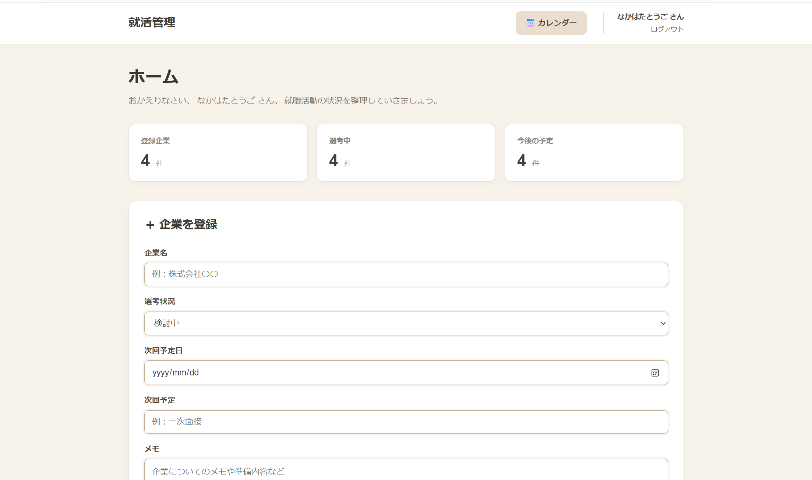
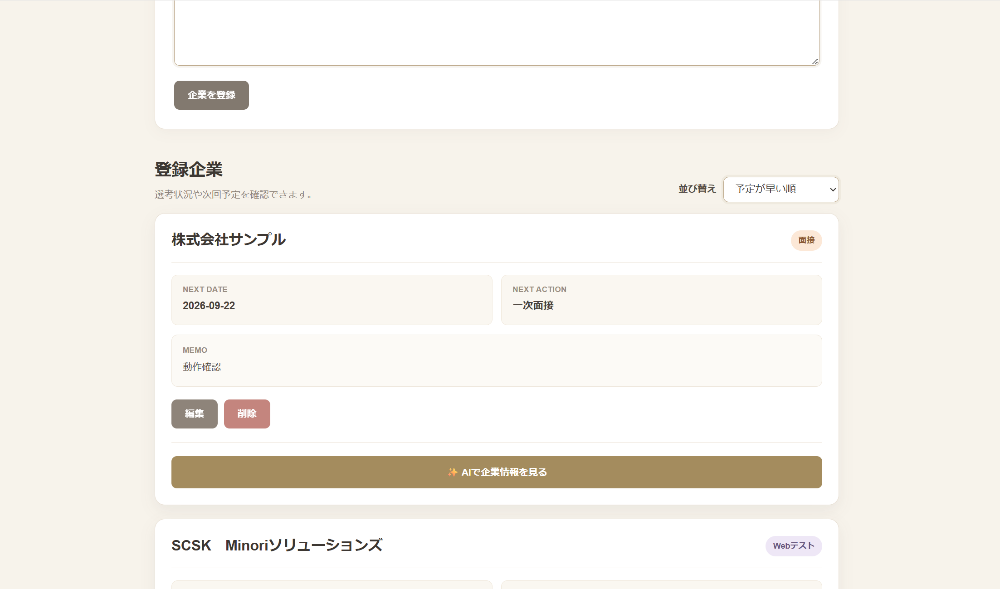
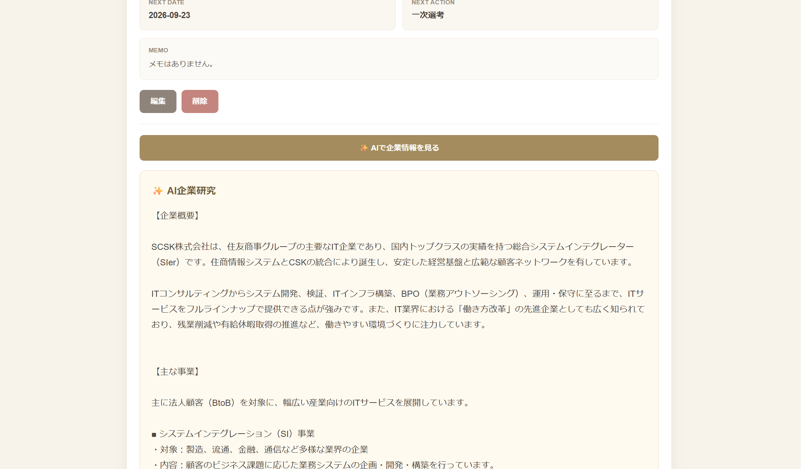
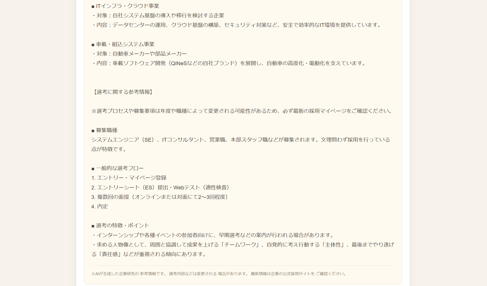
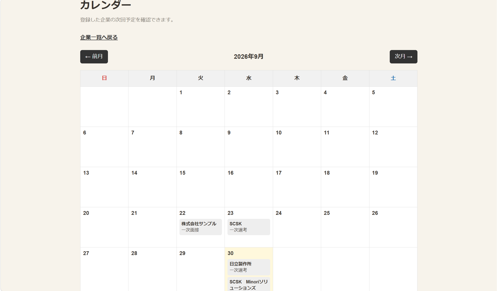

# 就活管理

就職活動における企業ごとの選考状況や今後の予定を、どこからでも手軽に管理できるWebアプリです。

企業情報・選考状況・次回予定をまとめて管理できるほか、カレンダーによる予定確認や、Gemini APIを利用した企業情報の確認ができます。

## アプリ画面

### ホーム・企業管理

企業名、選考状況、次回予定日、次に行うこと、メモを登録し、企業ごとに管理できます。

### AIによる企業情報の確認

Gemini APIを利用し、登録した企業について「企業概要」「主な事業」「選考に関する参考情報」を確認できます。

### カレンダー

企業ごとに登録した次回予定を、月ごとのカレンダー形式で確認できます。

---

## 制作背景・目的

企業ごとに選考日程が異なるため、就職活動を進める中で予定や選考状況の管理が難しいと感じたことから制作しました。

スマートフォンに標準搭載されているカレンダーでは、大学やアルバイトなどのプライベートな予定と就職活動の予定が混在してしまいます。

そこで、就職活動に関する情報だけを一か所にまとめ、現在の選考状況や次の予定を簡単に確認できるWebアプリを目指しました。

## 主な機能

- ユーザー登録・ログイン
- 企業情報の登録・編集・削除
- 企業ごとの選考状況の管理
- 次回予定日・次に行うことの管理
- 企業情報の並び替え
- カレンダーによる就活予定の確認
- Gemini APIを利用した企業情報の確認
- ユーザーごとのデータ管理

## 使用技術

| 分類 | 使用技術 |
| --- | --- |
| フロントエンド | HTML / CSS |
| バックエンド | PHP |
| データベース | MySQL |
| AI | Gemini API |
| バージョン管理 | Git / GitHub |

## 工夫した点

### 1. AIによる不確かな情報の表示を防止

Gemini APIを利用した企業情報確認機能では、存在しない企業名などが入力された場合に、AIが不確かな企業情報を生成して表示しないように工夫しました。

企業研究に利用する機能であるため、もっともらしい誤情報を表示するのではなく、情報の信頼性を意識した設計にしています。

また、AIが表示する情報は参考情報として扱い、最新の採用情報については企業の公式サイトで確認するよう画面上にも表示しています。

### 2. 予定日の空欄を考慮したソート

企業を予定日順に並び替える際、予定日が登録されていない企業が一番上に表示されてしまう問題がありました。

そこで、予定日が設定されている企業を優先して表示し、予定日が空欄の企業は後ろに表示されるように処理を工夫しました。

### 3. 誤操作による削除を防止

企業情報を削除する際、ボタンを一度押しただけでデータが削除されると、誤操作によって必要な情報を失う可能性があります。

そのため、削除前に確認画面を表示し、本当に削除するかを確認してから処理を実行するようにしました。

### 4. ユーザーごとのデータ管理

ログインしているユーザーと企業情報を紐づけることで、ユーザーごとに異なる企業情報を管理できるようにしました。

## セキュリティ

- `password_hash()` を使用してパスワードをハッシュ化
- `password_verify()` を使用したログイン認証
- セッションを利用したログイン状態の管理
- ユーザーごとに企業情報を分けて管理
- GitHub上ではデータベース接続情報とAPIキーを非公開化

## 今後の改善予定

先輩・後輩・友人に実際に利用してもらい、得られたフィードバックと自身が利用して感じた課題をもとに、以下の改善を予定しています。

- **独自の実行環境・データベースへの移行**  
  現在利用している学習環境から、自分で構築したPHP・MySQL環境へ移行し、継続して利用できるようにする。

- **企業登録画面・企業一覧の折りたたみ機能**  
  登録企業が増えた場合でも画面を確認しやすいように、必要な部分だけを展開できるUIへ改善する。

- **入力エラー表示の改善**  
  未入力などがあった場合に、ユーザーが原因を理解しやすいメッセージを表示するなど、入力時の使いやすさを改善する。

- **カレンダー機能の拡張**  
  カレンダー上の予定をクリックすると、その企業の選考状況や次回予定などの詳細情報を確認できる機能を追加する。

## 制作を通して学んだこと

HTML・CSS・PHP・MySQLの基礎学習から始め、ログイン認証、データベース操作、カレンダー、外部APIなどを組み合わせたWebアプリを制作しました。

制作を進める中で、自分自身が「こんな機能があったら便利だ」と感じたものを実際に考え、実装して使える形にできたときに、Webアプリ開発の面白さややりがいを感じました。

また、完成したアプリを先輩・後輩・友人に実際に利用してもらい、使いにくい部分や追加してほしい機能について意見をもらいました。そのフィードバックをもとに改善点を整理し、「今後の改善予定」としてまとめています。

制作中に発生した問題についても、原因を一つずつ確認しながら修正することで、問題を分解し、試行錯誤しながら解決していく経験ができました。

今後も利用者の意見を取り入れながら、自分で課題を見つけ、より使いやすいアプリへ改善していきたいと考えています。

## 注意事項

データベース接続情報およびGemini APIキーは、セキュリティ保護のためGitHub上では公開していません。

AIが表示する企業情報は参考情報として利用し、最新の採用情報については各企業の公式サイトで確認することを想定しています。
